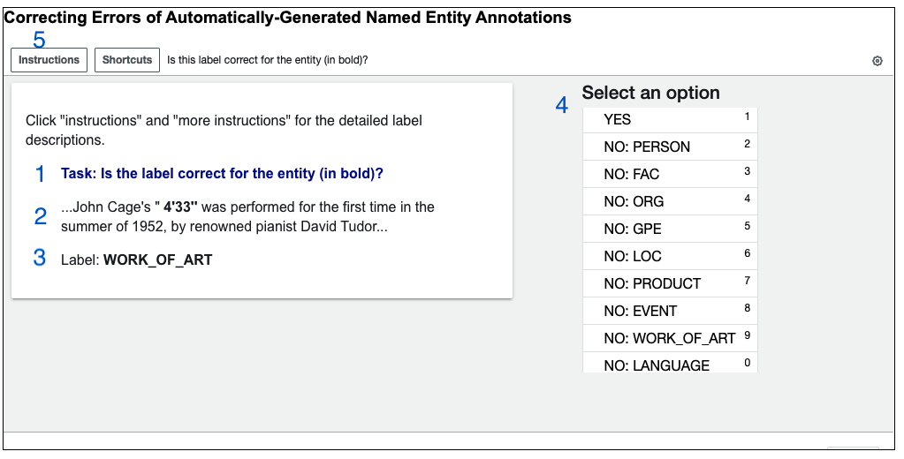
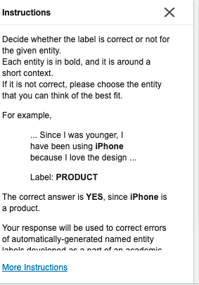
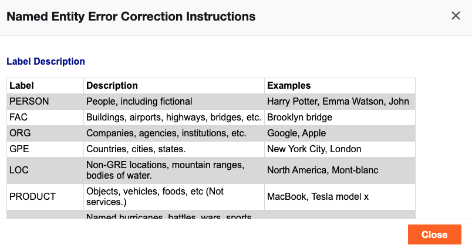

## Annotation Materials

### 1. Annotation Guidelines

This document explains the annotation guidelines for workers of Amazon Mechanical Turk. The preliminary named entity annotation is done by spaCy, so AMT workers will work on correcting the automatically-generated labels.

#### 1.1 **Task**

Decide whether the label is correct or not for the given entity. Each entity is in bold, and it is surrounded by a short context. If it is not correct, please choose the entity that you think would be the best fit.

For example,

```
... Since I was younger, I have been using **iPhone** because I love the design ...

Label: **PRODUCT**

```

The correct answer is **YES**, since **iPhone** is a product.

#### 1.2 **Label Descriptions**

|     Label          |     Description                                               |     Examples                                          |
|--------------------|---------------------------------------------------------------|-------------------------------------------------------|
|     PERSON         |     People, including fictional                               |     Harry Potter, Emma Watson, John                   |
|     FAC            |     Buildings, airports, highways,   bridges, etc.            |     Brooklyn bridge                                   |
|     ORG            |     Companies, agencies, institutions,   etc.                 |     Google, Apple                                     |
|     GPE            |     Countries, cities, states.                                |     New York City, London                             |
|     LOC            |     Non-GRE locations, mountain   ranges, bodies of water.    |     North America, Mont-blanc                         |
|     PRODUCT        |     Objects, vehicles, foods, etc (Not   services.)           |     MacBook, Tesla model x                            |
|     EVENT          |     Named hurricanes, battles, wars,   sports events, etc.    |     WW2, battle of waterloo                           |
|     WORK_OF_ART    |     Title of books, songs, etc.                               |     The diary of Anne Frank, Pride and   Prejudice    |
|     LANGUAGE       |     Any named language.                                       |     Korean, English, French                           |
|     N/A            |     None of the above.                                        |     -                                                 |


### 2. Mechanical Turk Setup

The actual page of Mechanical Turk Sandbox that will be given to annotators is as below. The html file is uploaded in the [repo](https://github.ubc.ca/iameleve/COLX_523_Group2/blob/master/annotation/mturk_layout.html) as well. 



- 1: The question of each assignment.
- 2: The sentence that contains a named entity, which is in bold.
- 3: The current label of the named entity.
- 4: Options that annotators can choose. If the label (3) is correct, then they need to choose YES, if not, they need to choose another appropriate option.
- 5: Detailed instructions which link to another pop-up box as below.

 


### 3. A CSV file for uploading to Mechanical Turk

The csv file that will be published to AMT is as below. The actual file is uploaded in the [repo](https://github.ubc.ca/iameleve/COLX_523_Group2/blob/master/annotation/mturk_case_study.csv). It contains 41 examples. Also, the code for generating the csv file is in this [link](https://github.ubc.ca/iameleve/COLX_523_Group2/blob/master/src/NE_Annotation_for_MTurk.ipynb).

|   talk_id  |   para_id  |   entity_id  |   before         |   entities  |   after                                                                                    |   label        |
|------------|------------|--------------|------------------|-------------|--------------------------------------------------------------------------------------------|----------------|
|   4        |   6        |   1          |   John Cage's "  |   4'33''    |   was performed for the first time in the summer of 1952, by renowned pianist David Tudor  |   WORK_OF_ART  |

- talk_id: The index of document.
- para_id: The index of paragraph.
- entity_id: The index of entity.
- before: The context before the current entity.
- entity: The current target entity.
- after: The context after the current entity.
- label: The label of the current entity generated by spaCy.